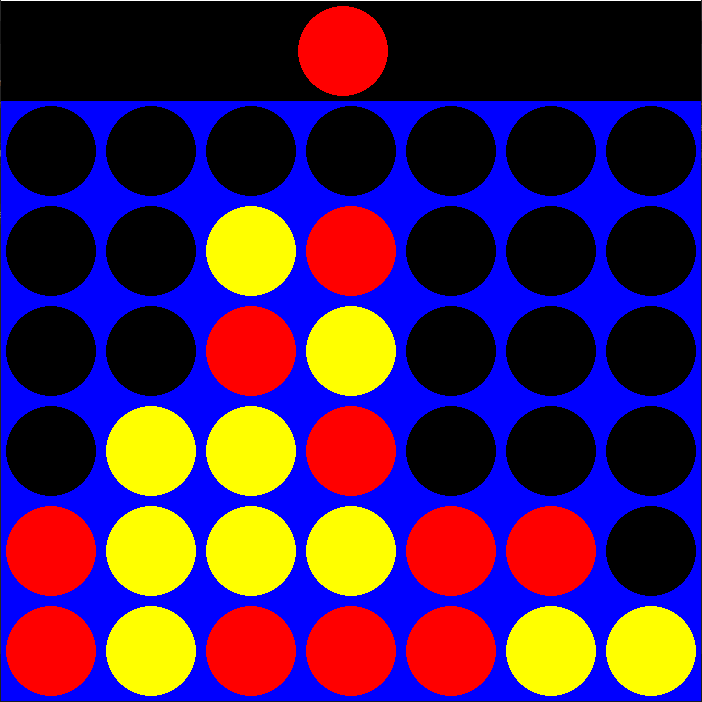

# Connect 4 - Python / Pygame

A simple **Connect 4 game** built with **Python** and **Pygame**, where you can play against an AI using the **Minimax algorithm with alpha-beta pruning**.

## Features

- Play against a computer AI
- Adjustable AI difficulty (choose Minimax depth)
- Simple and responsive controls

## How to Play

1. Run the game :
   You can download the Windows executable from the [latest release](https://github.com/MaximeClere/Connect-4/releases/latest)
3. Choose the AI difficulty by clicking a button (depth 1-6).
4. The player uses the mouse to select the column to drop a disc.
5. The first player to align 4 discs horizontally, vertically, or diagonally wins!

## AI Logic
- The AI uses the Minimax algorithm to anticipate moves.
- Uses heuristics to evaluate board positions.
- Employs alpha-beta pruning to improve performance.
